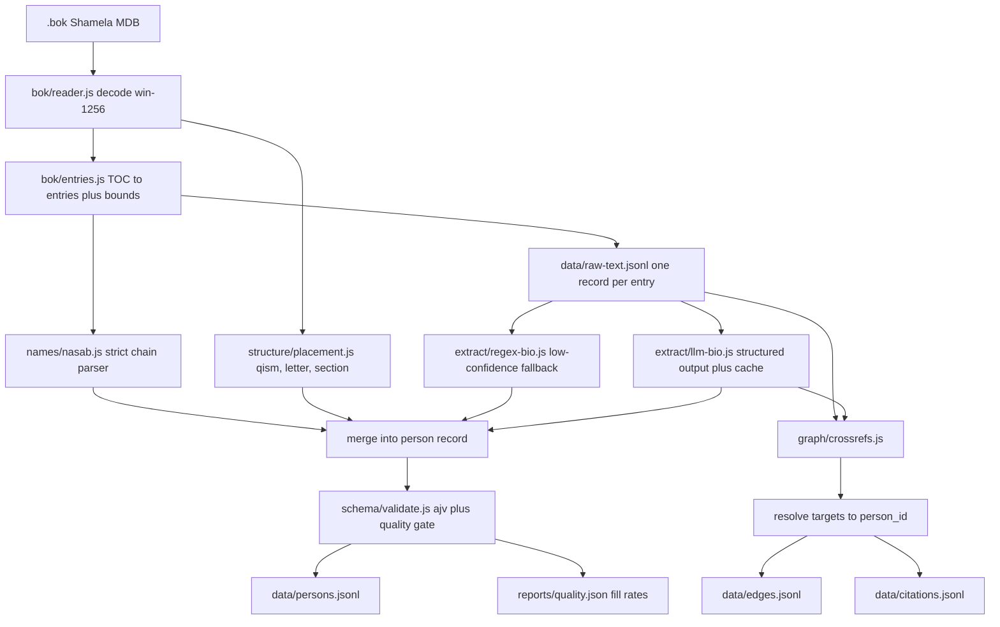

# Isabah Data Pipeline Rebuild

## Goal

Turn the current prototype into a corpus that is trustworthy, queryable, and reproducible:

- deterministic structural facts at ~100% coverage, with raw Arabic text always preserved
- LLM-extracted biographical facts over the full corpus, each carrying source, evidence quote, and confidence
- formal schemas plus a quality gate so regressions are caught
- cross-references resolved into a real edge list
- JSONL outputs, stable IDs designed for a later Tahdhib merge

Confirmed decisions: LLM extraction now via an OpenAI-compatible HTTP API configured by env vars, full pass over all entries, JSONL storage (no database), regex layer retained only as a labeled fallback.

## Target architecture



## Phase 1 - Repo hygiene and reproducibility

Fixes audit issues 8 and 9.

- Add `.gitignore` entries for generated and source-heavy artifacts: `data/`, `*.bok`, `*.mdb`, `*.rar`, `*.pdf`, `*.html`, `all-persons.json`, `persons-index.json`. Keep `samples/` and `schema/` committed.
- Delete dead tooling: [bok-to-pdf.js](bok-to-pdf.js) (hardcoded Windows Chrome paths, orphan `isabah.mdb`) and the stale [sample-companion.json](sample-companion.json) (different shape, claims 12,308 entries vs actual 9,730).
- Drop unused PDF deps from [package.json](package.json): `pdf-parse`, `pdfjs-dist`, `pdfkit`. Add `ajv`, `ajv-formats`, and a dev test runner (`node:test` is sufficient, no dep needed).
- Rename the package to match the project (`isabah-corpus` or keep `sahihh-tree-db`, but pick one and use it consistently in README).
- Document the source-acquisition step in README: where the Shamela `.bok` comes from, expected `book_id` 9767, and a checksum so runs are verifiable.

## Phase 2 - Structural core and raw text store

Fixes audit issue 3 (unrecoverable data loss).

Split [extract-persons.js](extract-persons.js) (currently 890 lines doing everything) into modules:

- `src/bok/reader.js` - MDB load, `windows-1256` decode, `Main`/`b9767`/`t9767` table discovery. Lifted from `loadBook`.
- `src/bok/entries.js` - TOC to person entries, `end_id` bounds, page mapping, per-entry text assembly (from `getText`).
- `src/structure/placement.js` and `src/structure/chapters.js` - refactor of [book-structure.js](book-structure.js).

New canonical artifact `data/raw-text.jsonl`, one record per entry:

```json
{
  "person_id": "isabah:9767:p3881",
  "entry_number": 10680,
  "start_id": 3881,
  "end_id": 3894,
  "volume": "7",
  "page_start": 348,
  "page_end": 361,
  "text": "...full Arabic entry text...",
  "text_body": "...footnotes stripped...",
  "footnotes": ["..."],
  "char_len": 41230
}
```

Every downstream layer reads from this file rather than re-parsing the `.bok`, so extraction can be re-run and audited without the source book. This directly removes the `// Full raw text intentionally omitted from JSON exports.` limitation at [extract-persons.js:491](extract-persons.js).

## Phase 3 - Stable IDs, nasab fix, category fix

Fixes audit issues 2, 6, 7, and lays groundwork for 10.

**Stable IDs.** `entry_number` is not unique (9,715 unique numbers across 9,730 rows; e.g. #170 maps to both `الأسود بن مالك` and `حزن`). Canonical key becomes `person_id = "isabah:9767:p<start_id>"`, which is unique by construction. Keep `entry_number` and add `entry_number_is_ambiguous: true` on the 14 collisions. This ID format is the hook for later cross-book linking.

**Nasab parser.** Current output bleeds prose into genealogy in ~11% of entries (`الخطاب»`, `نفيل القرشي العدوي، يأتي نسبه في ترجمة أخيه`, `حجر الأسلمي. له ولأبيه صحبة`). Rewrite `parseFullName`/`takeNasabPhrase` into `src/names/nasab.js` as an explicit tokenizer rather than score-and-hope:

- strip `»`, `«`, bracketed footnote markers, and inline `(n)` before splitting
- terminate the chain at the first sentence boundary, cross-reference clause (`يأتي نسبه`, `تقدم نسبه`), or biographical verb
- validate each segment: max ~40 chars, no verbs, no punctuation mid-segment; reject the whole chain and fall back to the TOC name if a segment fails
- separate trailing nisba(s) into `nisba[]` instead of gluing them onto the last ancestor
- emit `nasab_confidence` and `nasab_rejected_reason` so bad chains are visible instead of silently wrong

**Category fields.** ~2,015 entries have `category_label` set to a TOC bab (`تتمة العين بعدها الباء`) rather than a qism title. Separate the concepts explicitly: `qism` (1-4 numeric), `qism_label` (from the fixed `QISM_LABEL` map), `toc_heading` (whatever the nearest TOC node says), `toc_path[]`. No field mixes the two.

## Phase 4 - Formal schema and quality gate

Fixes audit issue 4.

- `schema/person.schema.json`, `schema/edge.schema.json`, `schema/raw-text.schema.json` as real JSON Schema (draft 2020-12), replacing the implicit shape in [companion-schema.js](companion-schema.js).
- `src/schema/validate.js` using ajv; every write path validates and fails loudly.
- Bump `schema_version` to `2.0.0` (breaking: provenance-wrapped facts, new IDs, renamed category fields).
- `tests/` with `node:test` golden fixtures covering the range of entry shapes: 10680 Abu Hurayra (long, kunya section), 4852 Ibn Umar (long, names section), 277 Anas, 7610 Malik b. Aws (short stub), one qism-4 entry, one women-section entry, one of the 14 duplicate-number entries.
- Nasab sanity assertions as tests: no `»`, no verb tokens, chain length <= 20, segment length <= 40.
- `reports/quality.json` emitted per run with per-field fill rates and nasab rejection rate. A `npm run gate` command fails if fill rates drop below the recorded baseline, so the 31% summary / 9% timeline / 0.1% narrated_from problem cannot silently return.

## Phase 5 - LLM client

- `src/extract/llm-client.js` speaking the OpenAI-compatible chat completions API. Config purely from env: `OPENAI_API_KEY`, `OPENAI_BASE_URL` (default `https://api.openai.com/v1`), `LLM_MODEL`, `LLM_CONCURRENCY`, `LLM_MAX_TOKENS`. No key ever written to disk or committed.
- Structured output via `response_format` with a JSON schema derived from the extraction schema, so responses are parseable by construction; retry with repair prompt on schema violation.
- Content-addressed cache at `data/llm-cache/<sha256 of model + prompt_version + text>.json`. Essential for a full pass: re-runs after a prompt tweak only re-hit changed entries, and an interrupted run resumes free.
- Checkpointed runner writing `data/llm-progress.jsonl`, resumable by `person_id`.
- Exponential backoff on 429/5xx, bounded concurrency, and a token/cost log at `reports/llm-usage.json`.
- Budget guard: `--max-cost` flag aborts the run before exceeding a set spend. Corpus is roughly 3-5M input tokens for a full pass, so this matters.

## Phase 6 - LLM biographical extraction

Fixes audit issue 1, the core problem (68.6% of entries near-empty).

`src/extract/llm-bio.js`:

- Input is `text_body` from `data/raw-text.jsonl` plus structural hints (display name, parsed nasab, qism, section type).
- Long entries chunked on paragraph boundaries with a token budget, then results merged and deduplicated per field.
- Prompt versioned in `prompts/bio-extract.v1.md` and hashed into the cache key. Instructions: extract only what the text states, quote evidence verbatim, output `null` rather than guessing, do not translate.

Every extracted fact is a provenance object, not a bare string:

```json
{
  "value": "شهد خيبر",
  "source": "llm",
  "evidence": "كان مقدمه عام خيبر، وكانت في المحرم سنة سبع",
  "confidence": 0.9,
  "page": 348
}
```

Add normalized, actually-queryable fields alongside the prose facts, since arrays of Arabic sentences are not queryable:

- `death: { year_hijri, year_uncertain, place, cause }` and the same for birth
- `battles: []` against a controlled vocabulary in `vocab/battles.json` (badr, uhud, khaybar, tabuk, yarmuk, ...)
- `offices: [{ role, place, appointed_by, period }]`
- `tribe`, `nisba[]`, `kunya`, `is_woman`
- `narrated_from[]`, `narrated_to[]` as normalized name keys plus original surface form
- `vocab/places.json` and `vocab/authorities.json` for the same treatment

The existing regex layer in [bio-extract.js](bio-extract.js) is kept but de-hardcoded: remove the Abu-Hurayra-specific patterns (`وحدث أبو هريرة أيضا عن`, `احتوى من حديث أبي هريرة على`, `كان اسم أبي هريرة`) and mark all its output `source: "regex"`, `confidence: 0.3`. It becomes the fallback when an LLM call fails or is skipped, never the primary.

## Phase 7 - Full corpus run

- Pilot on ~200 stratified entries (long/short, all four qism, women, kunya), hand-check against the source text, tune the prompt, record measured cost per 1,000 entries.
- Full run over all 9,730 entries with concurrency and cache enabled.
- Publish `reports/quality.json` fill rates as the new gate baseline, plus a manifest recording model, prompt version, run date, and token spend so the corpus is attributable.

## Phase 8 - Cross-reference graph

Fixes audit issue 5 (currently 1,245 snippet refs, zero resolved targets).

`src/graph/crossrefs.js`, extending `parseCrossRefs`:

- numeric refs (`يأتي في ترجمة رقم N`, `تقدم N`) resolved to `person_id` via the number index; collisions flagged `ambiguous: true` rather than silently picked
- section refs (`في الكنى`, `في النساء`, `في حرف X`) resolved by normalized-name match restricted to that section
- authority mentions (Ibn Manda, Abu Nu'aym, Ibn Abd al-Barr, al-Bukhari, ...) routed to `data/citations.jsonl`, not the person graph, since they are sources rather than companions
- `narrated_from` / `narrated_to` from Phase 6 become edges with `target_person_id` when the name matches a companion, otherwise retained as unresolved literals

`data/edges.jsonl` shape:

```json
{
  "from_person_id": "isabah:9767:p3881",
  "to_person_id": "isabah:9767:p1899",
  "to_literal": null,
  "type": "narrated_to",
  "source": "llm",
  "evidence": "روى عنه ابن عمر",
  "resolved": true,
  "ambiguous": false
}
```

## Phase 9 - Outputs, CLI, docs

- Emit `data/persons.jsonl`, `data/index.jsonl` (lightweight, now actually including `qism`, `letter`, `section_type` as README claims), `data/edges.jsonl`, `data/citations.jsonl`, `data/raw-text.jsonl`. Streaming writes throughout, so the 32MB single-blob export and its bespoke streaming JSON assembler in `exportPersonsStream` both go away.
- `src/cli.js` commands: `ingest`, `extract --llm`, `graph`, `validate`, `gate`, `export`, `search`, `get`, `structure`, `stats`.
- Commit small `samples/` files (one long entry, one stub, one qism-4) so the shape is reviewable in git without the 32MB artifact.
- Rewrite README to match reality: actual field coverage numbers, provenance model, LLM run requirements and cost, honest phase status for Tahdhib and cross-book linking rather than implying they exist.

## Notes on sequencing

Phases 1-4 are deterministic and independently verifiable; they should land before any LLM spend, because the quality gate and golden fixtures are what make the Phase 7 full run auditable. Phase 5 is pure infrastructure and can be built in parallel with Phase 3.